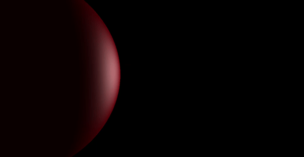
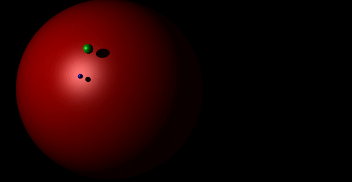

# vpeGameEngine(Visual Project for Educational purposes)

Opencv 3.0  

Used libraries :  
1.mesa3D (opengl implementation)  
2.glut (for the window)  
3.glm (for more effective basic vector operations)  
4.glew (for extension support control)

Used languages :  
1.C++  
2.glsl  

Ray tracing and phong model implemented.  
Elastic collision and gravity force implemented.  
Has control on camera position and direction via keyboard.   
The most complex operation which used in is cross product =)  

